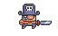

#Platformer en Godot 4.2.2 

Este template está diseñado para ayudar a los usuarios a crear juegos de plataformas 2D en Godot 4.2.2 de manera rápida y sencilla, utilizando el sistema mejorado de Tilemap, especialmente la capacidad de colocar escenas. El objetivo es que sea un template amigable para principiantes, para apoyar a nuevos desarrolladores o aquellos que no se sientan demasiado cómodos con la programación, y al mismo tiempo proporcionar una base para desarrolladores más experimentados que quieran crear rápidamente un proyecto bastante grande. Este juego está ambientado con una temática pirata, ofreciendo una experiencia de aventura y exploración en alta mar.

## Créditos
Assets de Treasure Hunters - <https://pixelfrog-assets.itch.io/treasure-hunters>

## Inlcuye
- Nivel base
- Enemigo base
  - Crawler 
- Interactuables
  - Salida
  - Monedas coleccionables
  - Zonas de muerte
- Player con movientos base
  - Salto que interactua con el suelo (capacidad de modificar tiempo post suelo para saltar)
    - El salto depende de cuanto tiempo se presione
- Colisiones entre el Player y los enemigos
- UI básica con el estilo de piratas
- Un selector de niveles

## Como instalar
Clonar el repo con git clone o descargar el .zip.
Importar y abrir en godot

> [!WARNING]
> Este proyecto fue desarrollado con Godot 4.2.2
